## Overview

Flows (also called Sankey diagrams) visualize the paths users take through your product. See what users do before and after any event, discover common patterns, and identify unexpected behaviors.

## Use Cases

<AccordionGroup>
  <Accordion title="User Journey Discovery">
    - What do users do after connecting their wallet?
    - What actions lead to a first transaction?
    - Where do users go after viewing the pricing page?
  </Accordion>
  
  <Accordion title="Drop-off Analysis">
    - Where do users go instead of converting?
    - What do users do after abandoning checkout?
    - Why are users leaving the swap page?
  </Accordion>
  
  <Accordion title="Feature Discovery">
    - How do users discover feature X?
    - What's the typical path to becoming a power user?
    - Do users explore multiple chains before settling?
  </Accordion>
</AccordionGroup>

## Quick Start

<Steps>
  <Step title="Select Starting Event">
    Choose the event to center your analysis:
    
    ```
    Starting Event: wallet_connect
    ```
  </Step>
  
  <Step title="Choose Direction">
    Analyze what happens before, after, or both:
    
    ```
    Direction: Steps After
    Number of steps: 5
    ```
  </Step>
  
  <Step title="Configure Display">
    - Set number of steps to show
    - Choose to hide specific events
    - Apply breakdowns
  </Step>
  
  <Step title="Analyze Patterns">
    Identify common paths and unexpected behaviors
  </Step>
</Steps>

## Flow Directions

### Steps After

See what users do **after** an event:

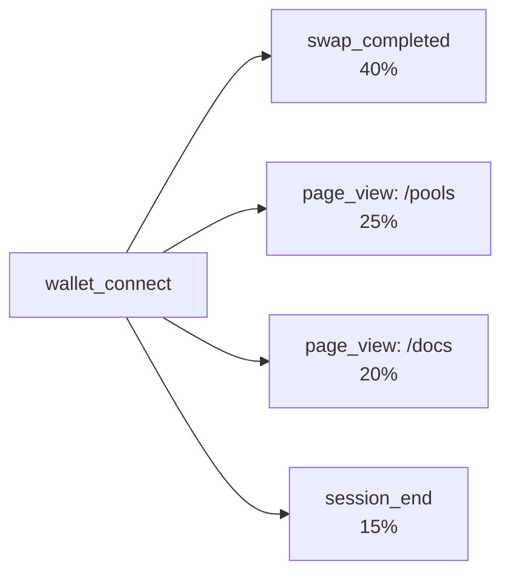

**Use for:**
- Understanding what users do after key milestones
- Identifying next-step opportunities
- Finding unexpected behaviors

### Steps Before

See what users do **before** an event:

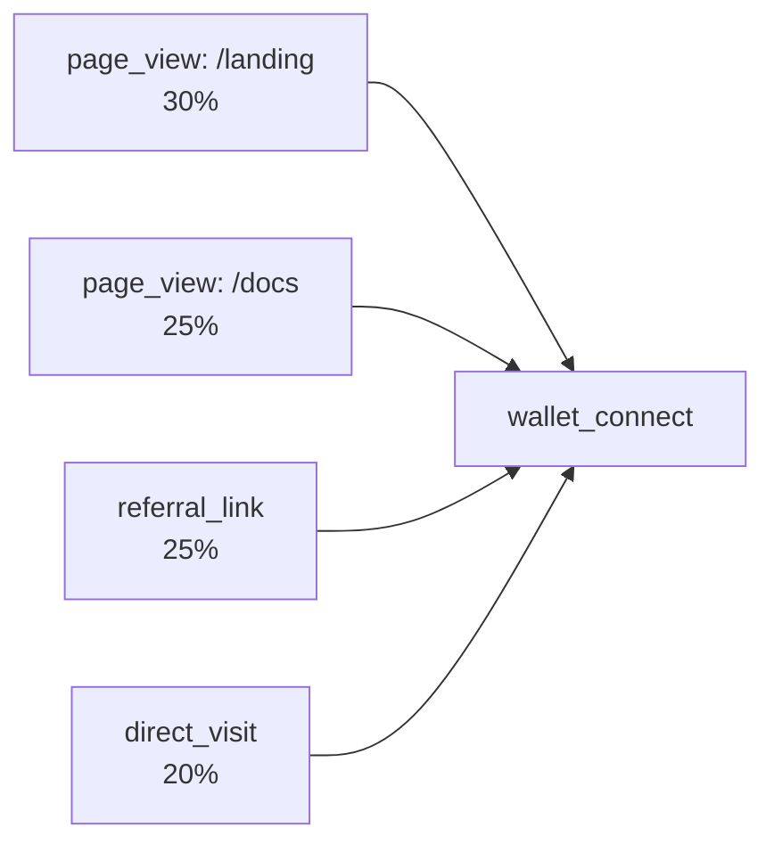

**Use for:**
- Understanding what leads to conversions
- Identifying effective entry points
- Discovering successful paths

### Steps Before & After

See the complete journey around an event:

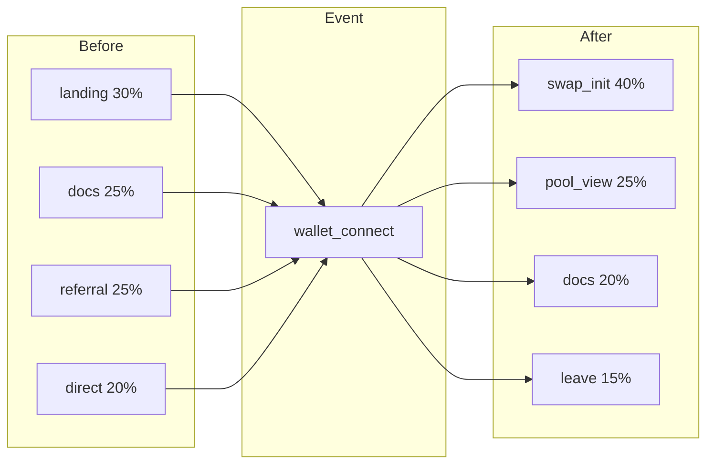

**Use for:**
- Complete journey understanding
- Before/after comparisons
- Holistic flow analysis

## Reading Flow Diagrams

### Sankey Structure

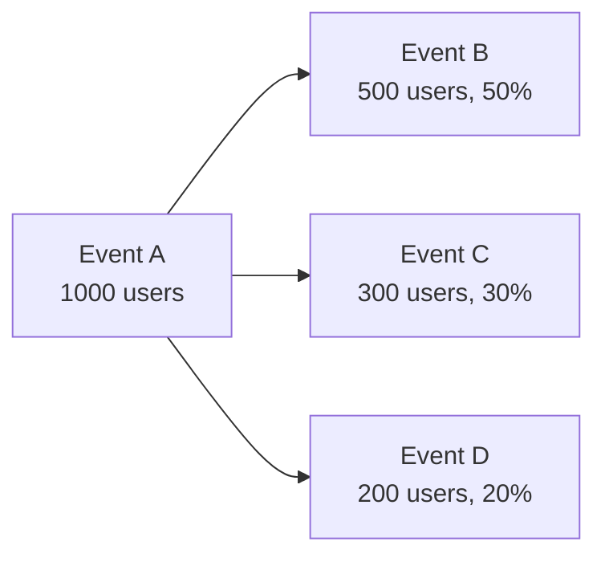

**Wider paths** = More users taking that route
**Percentages** = Share of users from previous step

### Multi-Step Flows

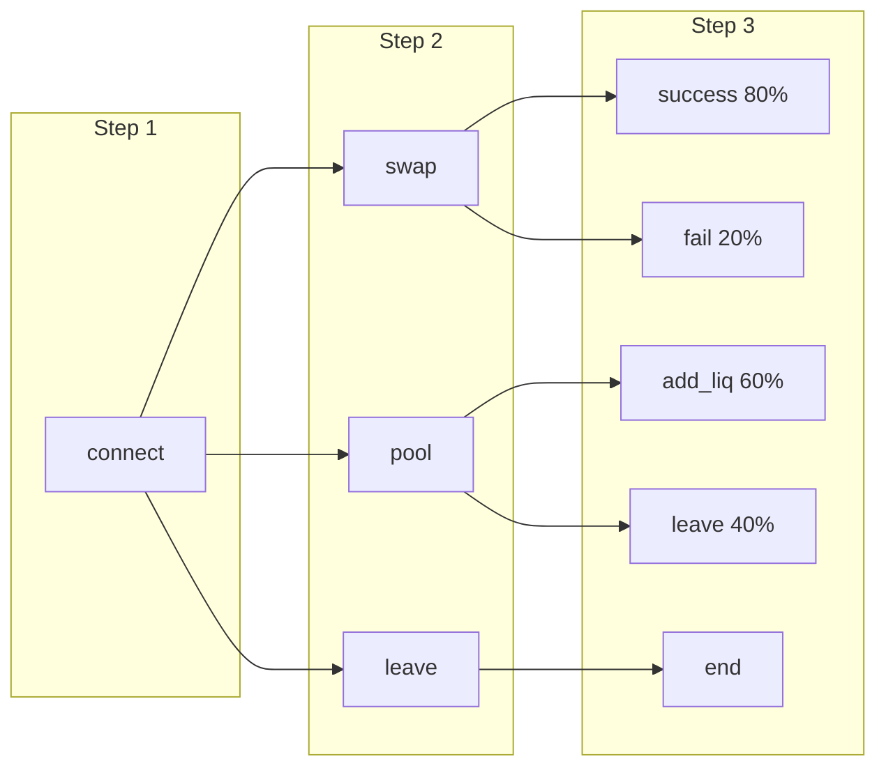

## Configuration Options

### Number of Steps

Control how many steps to display:

```
1 step: Immediate next action only
3 steps: Short journey
5 steps: Medium journey (recommended)
10 steps: Full exploration
```

### Hide Events

Remove noise by hiding irrelevant events:

```
Hide events:
- page_view (too noisy)
- scroll (not meaningful)
- mouse_move (irrelevant)

Keep:
- wallet_connect
- swap_completed
- transaction
```

### Breakdown by Property

Split flows by a property:

```
Breakdown: device_type

Mobile:
connect → swap (25%) → success

Desktop:
connect → swap (45%) → success

→ Desktop users convert better!
```

## Filters

Focus on specific user segments or behaviors:

### Event Filters

Filter the starting event:

```
Starting Event: wallet_connect
  └── where: wallet_type = "metamask"

Only MetaMask connections
```

### User Filters

Filter by user properties:

```
User Filter:
├── country = "US"
├── AND plan = "pro"

US Pro users only
```

### Time Filters

Analyze specific periods:

```
Time Range: Last 30 days
Granularity: Daily

See recent behavior patterns
```

## Web3 Flow Examples

### Post-Wallet Connection

**Starting Event:** `wallet_connect` · **Direction:** 5 Steps After

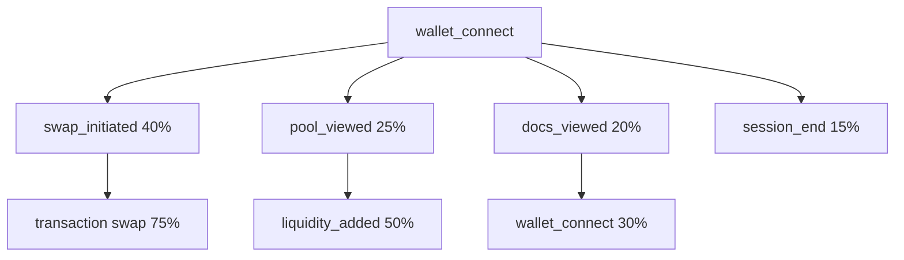

### Pre-Transaction Path

**Starting Event:** Transaction (any) · **Direction:** 5 Steps Before

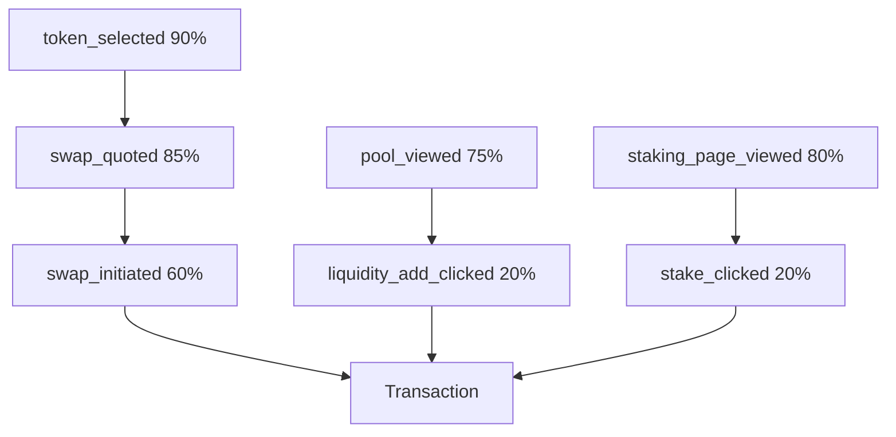

### Cross-Chain Exploration

**Starting Event:** `chain_changed` · **Breakdown:** new_chain

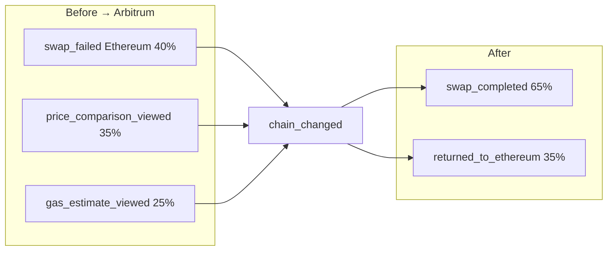

### NFT Journey

**Starting Event:** `nft_viewed` · **Filter:** collection = "CoolCats"

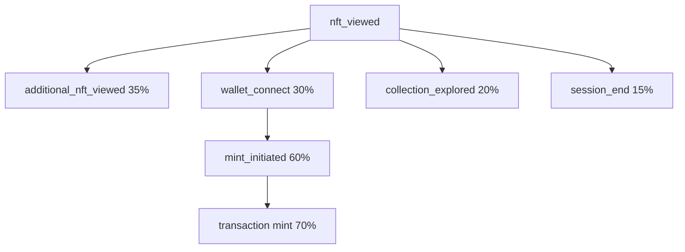

## Analyzing Flows

### Identifying Patterns

**High-Volume Paths:**
Look for the thickest flows—these are your main user journeys.

```
If 60% of users go: landing → docs → wallet_connect
→ Optimize this path! It's your main funnel.
```

**Unexpected Paths:**
Look for surprising flows.

```
If 20% of users go: checkout → settings → checkout
→ Are they looking for payment options?
```

### Identifying Drop-Off

**Exit Points:**
Where do users leave?

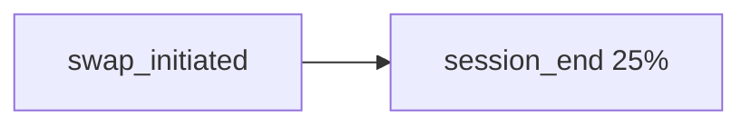
→ Users leaving before completing—investigate UX

**Detours:**
Where do users go instead of converting?

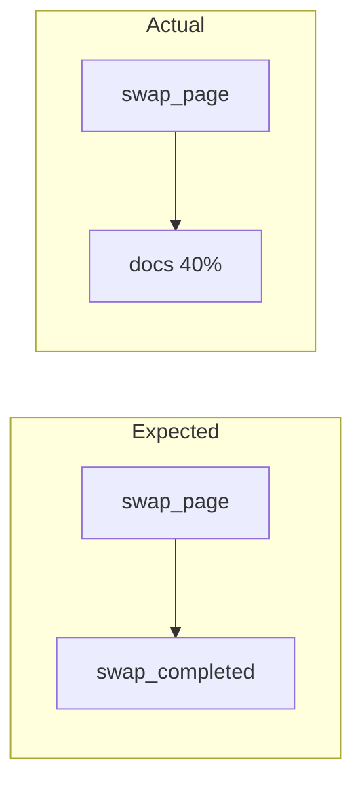
→ Users need more information before swapping

### Comparing Segments

Use breakdowns to compare:

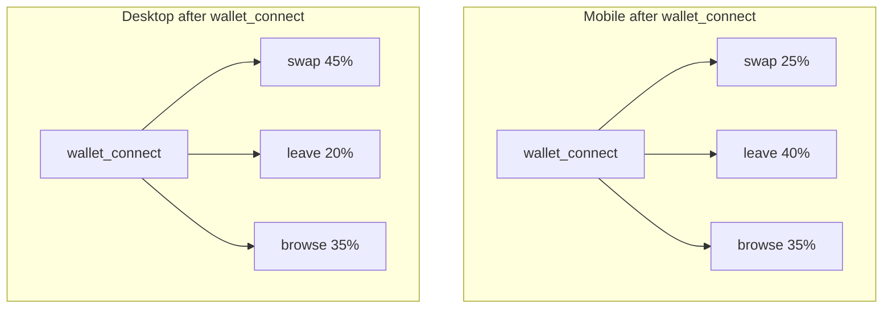
→ Mobile users leaving more—mobile UX issue?

## Best Practices

### Choose Meaningful Starting Events

```
✅ Good starting events:
- wallet_connect (key milestone)
- purchase_completed (conversion point)
- feature_used (engagement signal)
- signup_completed (lifecycle event)

❌ Poor starting events:
- page_view (too broad)
- click (too generic)
- scroll (not meaningful)
```

### Hide Noise

Remove events that obscure patterns:

```
Hide:
- Generic page_views (keep specific ones)
- Scroll events
- Mouse events
- Internal/system events
```

### Use Appropriate Step Counts

```
Immediate impact: 1-2 steps
Journey analysis: 3-5 steps
Full exploration: 5-10 steps

More steps = more complexity
Start small, expand as needed
```

### Segment Meaningfully

```
✅ Actionable breakdowns:
- device_type (fix mobile?)
- traffic_source (optimize channel?)
- user_tier (different needs?)

❌ Not actionable:
- random_id
- timestamp
```

## Saving & Sharing

### Save Flow

1. Configure your flow analysis
2. Click **Save**
3. Name it: "Post-Wallet Connect Journey"

### Add to Board

Include flows in dashboards for ongoing monitoring. All saved flows can be added to boards.

## Next Steps

<CardGroup cols={2}>
  <Card title="Boards" icon="table-columns" href="/analysis/boards">
    Create dashboards with flows
  </Card>
  <Card title="Cohorts" icon="users" href="/analysis/cohorts">
    Analyze flows for specific segments
  </Card>
</CardGroup>
