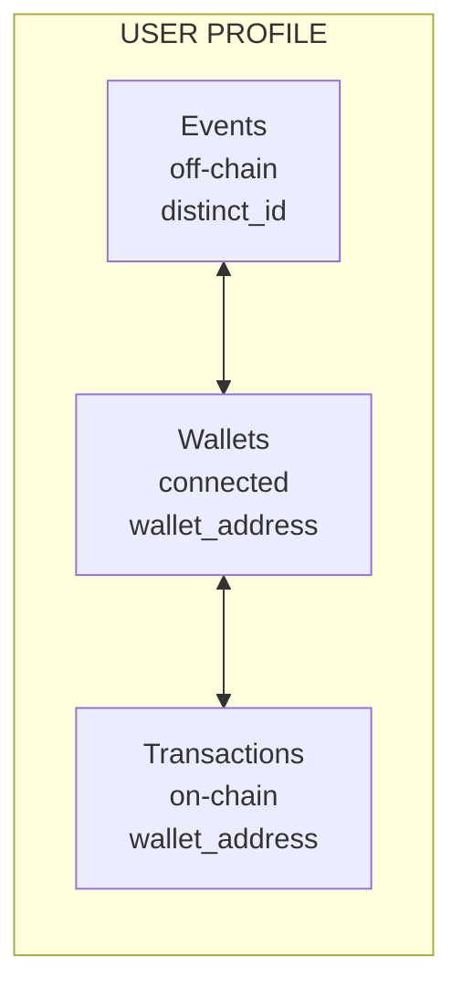
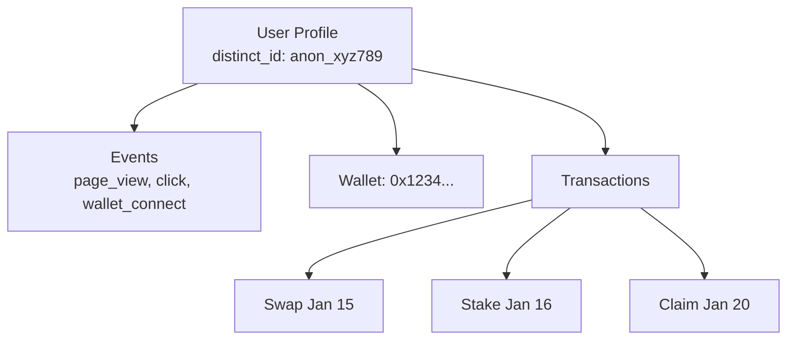
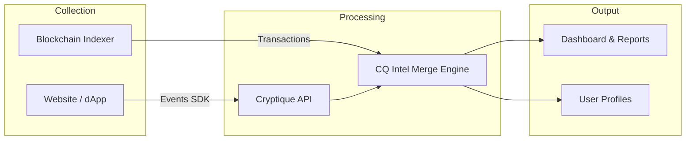

## Overview

Cryptique's data model is designed to solve the unique challenges of Web3 analytics by unifying three types of data into cohesive user profiles:



## Core Concepts

### Events

Events are discrete actions that users take. They form the foundation of behavioral analytics.

```javascript
{
  "event_name": "swap_initiated",
  "distinct_id": "user_12345",
  "timestamp": "2024-01-15T10:30:00Z",
  "properties": {
    "input_token": "ETH",
    "output_token": "USDC",
    "amount": 1.5
  }
}
```

**Event Types**:
- **Auto-events**: Automatically captured (page_view, click, scroll, etc.)
- **Custom events**: Tracked via `Cryptique.track()`
- **Transaction events**: Generated from indexed smart contracts

See [Events & Properties](/data-in/events-and-properties) for details.

### User Profiles

User profiles aggregate all activity for a single user, identified by `distinct_id`.

```javascript
{
  "distinct_id": "user_12345",
  "properties": {
    // Identity
    "email": "user@example.com",
    "username": "defi_whale",
    
    // Lifecycle
    "first_seen": "2024-01-01T00:00:00Z",
    "last_seen": "2024-01-15T10:30:00Z",
    "session_count": 47,
    
    // Custom
    "plan": "pro",
    "referral_source": "twitter",
    
    // Web3
    "wallets": ["0x1234...", "0xabcd..."],
    "primary_wallet": "0x1234...",
    "is_web3_user": true
  }
}
```

**Profile Sources**:
- **identify()**: Explicitly set user properties
- **people methods**: Set, increment, append properties
- **Wallet enrichment**: Automatically added from blockchain data
- **Computed**: Derived from event history

See [User Profiles](/data-in/user-profiles) for details.

### Transactions

On-chain transactions from your indexed smart contracts.

```javascript
{
  "transaction_hash": "0xabc123...",
  "wallet_address": "0x1234567890abcdef...",
  "contract_name": "Swap Router",
  "method_name": "swapExactTokensForTokens",
  "timestamp": "2024-01-15T10:30:15Z",
  "chain": "ethereum",
  "properties": {
    "input_token": "0xC02aaA39b223FE8D0A0e5C4F27eAD9083C756Cc2",
    "output_token": "0xA0b86991c6218b36c1d19D4a2e9Eb0cE3606eB48",
    "amount_in": "1500000000000000000",
    "amount_out": "1500000000"
  }
}
```

See [Transactions](/data-in/transactions) for details.

## Data Linking

The power of Cryptique is in automatically linking these data types:

### distinct_id ↔ wallet_address

When a user connects their wallet:

```javascript
// User visits site (anonymous)
distinct_id: "anon_xyz789"

// User connects wallet
Cryptique.walletAddress("0x1234...");

// Profile now linked
{
  "distinct_id": "anon_xyz789",
  "wallet_address": "0x1234..."
}
```

### wallet_address ↔ Transactions

Once a wallet is linked, all transactions from that wallet are attributed to the user:



### Multiple Wallets

Users can connect multiple wallets:

```javascript
Cryptique.walletAddress("0x1234..."); // First wallet
Cryptique.walletAddress("0xabcd..."); // Second wallet

// Profile now has both
{
  "distinct_id": "user_12345",
  "wallets": ["0x1234...", "0xabcd..."],
  "primary_wallet": "0x1234..."
}
```

## Property Types

Cryptique supports these property data types:

| Type | Example | Operators |
|------|---------|-----------|
| **String** | `"ethereum"` | is, is_not, contains, is_set |
| **Number** | `1500.50` | equals, greater_than, less_than, between |
| **Boolean** | `true` | is_true, is_false |
| **Date/Datetime** | `"2024-01-15"` | before, after, between, in_the_last |
| **List** | `["ETH", "USDC"]` | any_in_list, all_in_list + item operators |
| **Object** | `{name: "...", value: 100}` | Nested property access |

See [Filters & Operators](/analysis/filters-and-operators) for full operator reference.

## Sessions

Sessions group user activity with these rules:

- **Timeout**: 30 minutes of inactivity starts a new session
- **Midnight**: New session at midnight (user's local time)  
- **UTM change**: New campaign parameters start a new session

Session properties are inherited by all events within the session:

```javascript
// Session properties (set once)
{
  "session_id": "sess_abc123",
  "initial_referrer": "https://twitter.com/...",
  "utm_source": "twitter",
  "landing_page": "/"
}

// Event inherits session context
{
  "event_name": "swap_completed",
  "session_id": "sess_abc123",  // inherited
  "utm_source": "twitter"       // inherited
}
```

## Data Flow



1. **Collection**: SDK sends events; indexer captures transactions
2. **Processing**: CQ Intelligence links wallets to users
3. **Enrichment**: Wallet data adds profile properties
4. **Storage**: Unified profiles stored for analysis
5. **Query**: Reports access complete user journeys

## Next Steps

<CardGroup cols={2}>
  <Card title="Events & Properties" icon="bolt" href="/data-in/events-and-properties">
    Deep dive into event structure
  </Card>
  <Card title="User Profiles" icon="user" href="/data-in/user-profiles">
    Understand profile management
  </Card>
  <Card title="Transactions" icon="file-contract" href="/data-in/transactions">
    On-chain data integration
  </Card>
  <Card title="Default Properties" icon="list" href="/data-in/default-properties">
    Auto-captured properties
  </Card>
</CardGroup>
