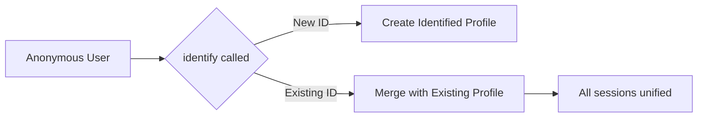

## Overview

Trodo automatically assigns anonymous IDs to track users. When you know who a user is (e.g., after login or wallet connection), use `identify()` to link their anonymous activity to their known identity.

<Info>
  Trodo's **CQ Intelligence merge engine** automatically consolidates user profiles across sessions, devices, and wallets when you call `identify()`.
</Info>

---

## Trodo.identify()

Associate the current user with a unique identifier.

```javascript
Trodo.identify(identifyId)
```

### Parameters

<ParamField path="identifyId" type="string" required>
  A unique identifier for the user. This could be:
  
  - User ID from your database
  - Email address
  - Wallet address
  - Any unique string that identifies this user
  
  Maximum length: **255 characters**
</ParamField>

### Returns

`void`

---

## Basic Usage

```javascript
// After user logs in
Trodo.identify('user_12345');

// Using email
Trodo.identify('user@example.com');

// Using wallet address
Trodo.identify('0x742d35Cc6634C0532925a3b844Bc9e7595f5bB21');
```

---

## When to Call identify()

<Steps>
  <Step title="After Login">
    When a user logs into your application:
    
    ```javascript
    async function handleLogin(email, password) {
      const user = await login(email, password);
      
      // Identify after successful login
      Trodo.identify(user.id);
      
      // Optionally set user properties
      Trodo.people.set({
        email: user.email,
        plan: user.subscription,
        signupDate: user.createdAt
      });
    }
    ```
  </Step>
  
  <Step title="After Signup">
    When a new user creates an account:
    
    ```javascript
    async function handleSignup(userData) {
      const newUser = await createUser(userData);
      
      // Identify the new user
      Trodo.identify(newUser.id);
      
      // Track signup event
      Trodo.track('Signup Completed', {
        source: userData.referralSource
      });
      
      // Set initial user properties
      Trodo.people.set({
        email: newUser.email,
        signupDate: new Date().toISOString()
      });
    }
    ```
  </Step>
  
  <Step title="On Page Load (Returning Users)">
    When a logged-in user returns:
    
    ```javascript
    // On app initialization
    async function initApp() {
      await Trodo.init({ siteId: 'your-site-id' });
      
      // If user is already logged in
      const currentUser = getCurrentUser();
      if (currentUser) {
        Trodo.identify(currentUser.id);
      }
    }
    ```
  </Step>
</Steps>

---

## Cross-Domain Identification

Trodo can merge user profiles across domains when you use the same `identifyId`:

```javascript
// On app.example.com
Trodo.identify('user_12345');

// On dashboard.example.com (same user)
Trodo.identify('user_12345');

// Trodo merges all sessions for user_12345 automatically
```

---

## Trodo.reset()

Clear the current user identity and start a new anonymous session. Use this when a user logs out.

```javascript
Trodo.reset()
```

### Returns

`void`

### Usage

```javascript
function handleLogout() {
  // Clear user session in your app
  logout();
  
  // Reset Trodo identity
  Trodo.reset();
  
  // Future events will use a new anonymous ID
}
```

<Warning>
  Always call `reset()` when a user logs out. Without this, the next user on the same device could be associated with the previous user's data.
</Warning>

---

## Wallet Address as Identity

You can use wallet addresses as the primary identifier:

```javascript
// When wallet connects
function handleWalletConnect(address) {
  // Use wallet address as identity
  Trodo.identify(address);
  
  // Also register with walletAddress for enrichment
  Trodo.walletAddress(address);
}
```

<Tip>
  Using wallet addresses as identifiers works well for Web3 apps where users may not have traditional accounts. The same user with multiple wallets will have separate profiles unless you link them with a common identifier.
</Tip>

---

## Identity Merge Behavior

When you call `identify()`:

1. **New User**: If the `identifyId` hasn't been seen before, the current anonymous profile is converted to an identified profile.

2. **Existing User, Same Device**: If the `identifyId` matches a profile already on this device, sessions merge seamlessly.

3. **Existing User, New Device**: If the `identifyId` exists from another device, Trodo's CQ Intelligence merges the profiles automatically.

4. **Group memberships**: When the server returns `group_memberships` for this user, the SDK restores them locally so [group](/data-in/sdk-reference/groups) assignments stay in sync across devices.



---

## Best Practices

### Use Persistent IDs

```javascript
// Good - Stable, unique identifiers
Trodo.identify(user.databaseId);    // '12345'
Trodo.identify(user.uuid);          // 'a1b2c3d4-e5f6-...'
Trodo.identify(user.walletAddress); // '0x742d...'

// Avoid - IDs that might change
Trodo.identify(user.username);      // User might change this
Trodo.identify(user.displayName);   // Not unique
```

### Don't Over-Identify

```javascript
// Bad - Calling identify too frequently
function onClick() {
  Trodo.identify(userId);  // Don't identify on every action
  Trodo.track('Button Clicked');
}

// Good - Identify once per session
async function initApp() {
  await Trodo.init({ siteId: 'your-site-id' });
  
  if (currentUser) {
    Trodo.identify(currentUser.id);
  }
}
```

### Handle Auth State Changes

```javascript
// React example with auth state listener
useEffect(() => {
  const unsubscribe = auth.onAuthStateChanged((user) => {
    if (user) {
      Trodo.identify(user.uid);
    } else {
      Trodo.reset();
    }
  });
  
  return () => unsubscribe();
}, []);
```

---

## Complete Authentication Flow

```javascript
// Initialize
await Trodo.init({ siteId: 'your-site-id' });

// Check for existing session
const user = getCurrentUser();
if (user) {
  Trodo.identify(user.id);
  Trodo.people.set({
    email: user.email,
    lastSeen: new Date().toISOString()
  });
}

// Login handler
async function login(credentials) {
  const user = await authService.login(credentials);
  
  Trodo.identify(user.id);
  Trodo.people.set({
    email: user.email,
    lastLogin: new Date().toISOString()
  });
  Trodo.track('Login Completed');
}

// Logout handler
function logout() {
  Trodo.track('Logout Completed');
  Trodo.reset();
  authService.logout();
}
```

---

## Related Methods

<CardGroup cols={2}>
  <Card title="User Properties" icon="user-gear" href="/data-in/sdk-reference/people">
    Set persistent user attributes
  </Card>
  <Card title="Groups" icon="users" href="/data-in/sdk-reference/groups">
    Company and team associations
  </Card>
  <Card title="Wallet Methods" icon="wallet" href="/data-in/sdk-reference/wallet">
    Track wallet connections
  </Card>
</CardGroup>
