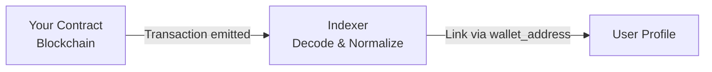

## Overview

Cryptique indexes transactions from your smart contracts and automatically links them to user profiles via wallet addresses. This creates complete attribution from first website visit to on-chain conversion.

## How It Works



1. **Index**: Cryptique monitors your contracts for new transactions
2. **Decode**: Transaction data is decoded into readable properties
3. **Link**: Transactions are attributed to users via wallet_address

## Transaction Structure

```javascript
{
  // Transaction identifiers
  "transaction_hash": "0xabc123...",
  "block_number": 18500000,
  "block_timestamp": "2024-01-15T10:30:15Z",
  
  // Contract info
  "contract_address": "0x7a250d5630B4cF539739dF2C5dAcb4c659F2488D",
  "contract_name": "Uniswap Router",  // Your friendly name
  "method_name": "swapExactTokensForTokens",
  "method_signature": "0x38ed1739",
  
  // Wallet (links to user profile)
  "wallet_address": "0x1234567890abcdef...",
  "from_address": "0x1234567890abcdef...",
  "to_address": "0x7a250d5630B4cF539739dF2C5dAcb4c659F2488D",
  
  // Chain
  "chain": "ethereum",
  "chain_id": 1,
  
  // Values
  "value": "0",                    // ETH value in wei
  "gas_used": "150000",
  "gas_price": "30000000000",      // 30 gwei
  "transaction_fee": "4500000000000000",  // Fee in wei
  
  // Decoded parameters (contract-specific)
  "decoded_input": {
    "amountIn": "1000000000000000000",
    "amountOutMin": "1450000000",
    "path": ["0xC02aaA39b223FE8D0A0e5C4F27eAD9083C756Cc2", "0xA0b86991c6218b36c1d19D4a2e9Eb0cE3606eB48"],
    "to": "0x1234567890abcdef...",
    "deadline": "1705315200"
  },
  
  // Status
  "status": "confirmed",  // pending, confirmed, failed
  "confirmations": 12
}
```

## Adding Smart Contracts

### Via Dashboard

1. Navigate to **Settings → Smart Contracts**
2. Click **Add Contract**
3. Enter:
   - **Contract Address**: `0x...`
   - **Chain**: Select from dropdown
   - **Friendly Name**: e.g., "Token Swap Contract"
   - **ABI** (optional): For better decoding
4. Click **Save**

### Supported Chains

**EVM Chains (35+)**:
- Ethereum, Polygon, Arbitrum, Optimism, Base
- Avalanche, BSC, Fantom, Gnosis, Linea
- zkSync, Scroll, Mantle, Blast, Mode
- And many more...

**Non-EVM Chains**:
- Solana
- Sui
- Aptos
- Near

## Transaction Attribution

### Automatic Linking

When a user connects their wallet, all transactions from that wallet are attributed to them:

```
User connects wallet:
Cryptique.walletAddress('0x1234...');

Profile created:
├── distinct_id: "user_12345"
├── wallets: ["0x1234..."]
└── transactions: []

Transaction occurs on-chain:
0x1234... calls your Swap Contract

Profile updated:
├── distinct_id: "user_12345"
├── wallets: ["0x1234..."]
└── transactions:
    └── Swap (0xabc...) - Jan 15, 10:30
```

### Multiple Wallets

Users with multiple wallets have all transactions aggregated:

```
User Profile:
├── wallets: ["0x1234...", "0xabcd..."]
└── transactions:
    ├── 0x1234... → Swap (Jan 15)
    ├── 0xabcd... → Mint (Jan 16)
    └── 0x1234... → Stake (Jan 17)
```

### Unknown Wallets

Transactions from wallets not yet connected to a user are stored and linked when the wallet connects:

```
Day 1: Transaction from 0x1234... (no profile yet)
       → Stored with wallet_address only

Day 5: User visits site and connects 0x1234...
       → All historical transactions linked to profile
```

## Using Transactions in Reports

### In Funnels

Combine off-chain and on-chain events:

```
Funnel: Website to Transaction
├── Step 1: page_view (landing page)
├── Step 2: wallet_connect
├── Step 3: swap_initiated (button click)
└── Step 4: [Transaction] swapExactTokensForTokens
```

### In Insights

Analyze transaction patterns:

- **Total transactions** over time
- **Unique transacting users** by week
- **Transaction value** broken down by method
- **Gas costs** by user segment

### In Retention

Measure on-chain retention:

```
Birth event: First transaction
Return event: Any subsequent transaction

→ See how many users transact again after 7, 14, 30 days
```

### In Cohorts

Create transaction-based segments:

```
Cohort: High-Value Traders
Criteria:
- Has done: Transaction
- Where: method_name = "swap"
- And: decoded_input.amountIn > 1000000000000000000 (1 ETH)
- In the last: 30 days
```

## Filtering & Breaking Down

### Transaction Properties

Use in filters and breakdowns:

| Property | Type | Example Filter |
|----------|------|----------------|
| `contract_name` | string | = "Swap Router" |
| `method_name` | string | = "swapExactTokensForTokens" |
| `chain` | string | = "ethereum" |
| `status` | string | = "confirmed" |
| `value` | number | > 0 (has ETH value) |
| `gas_used` | number | between 100000 and 500000 |
| `decoded_input.*` | varies | Custom decoded parameters |

### Cross-Data Queries

Combine with events and user properties:

```
Show me:
- Users who viewed /pricing page (event)
- AND connected wallet (event)  
- AND made a transaction (transaction)
- Where transaction amount > $100 (transaction property)
- AND user is from US (user property)
```

## Contract Display

Transactions are displayed with your friendly names:

```
Timeline for user_12345:
───────────────────────────
Jan 15, 10:30  │ Swap Router      │ swapExactTokensForTokens
Jan 16, 14:20  │ NFT Marketplace  │ buyItem
Jan 17, 09:15  │ Staking Contract │ stake
```

Not like this (raw addresses):

```
❌ Confusing:
Jan 15, 10:30  │ 0x7a250d5630...  │ 0x38ed1739
```

## Best Practices

### Name Contracts Clearly

```
✅ Good names:
- "Token Swap Router"
- "NFT Marketplace"
- "Staking Pool v2"
- "Governance Contract"

❌ Avoid:
- "Contract 1"
- "0x7a250d5630..."
- "Main"
```

### Provide ABIs

Upload contract ABIs for better decoding:

```json
// With ABI - Decoded nicely
{
  "method_name": "swapExactTokensForTokens",
  "decoded_input": {
    "amountIn": "1000000000000000000",
    "amountOutMin": "1450000000",
    "path": ["0xC02...", "0xA0b..."]
  }
}

// Without ABI - Raw data
{
  "method_name": "0x38ed1739",
  "input_data": "0x38ed17390000000000000000..."
}
```

### Monitor Multiple Contracts

Add all relevant contracts:

```
DeFi Protocol:
├── Swap Router
├── Liquidity Pool Factory
├── Staking Contract
├── Rewards Distributor
└── Governance Token

NFT Project:
├── NFT Contract
├── Marketplace
└── Royalty Splitter
```

## Limitations

| Limit | Value |
|-------|-------|
| Contracts per site | 50 |
| Historical backfill | 90 days |
| Indexing delay | ~30 seconds |
| Decoded properties | 100 per transaction |

## Next Steps

<CardGroup cols={2}>
  <Card title="Smart Contract Setup" icon="file-contract" href="/integrations/smart-contracts">
    Detailed contract configuration
  </Card>
  <Card title="Build Funnels" icon="filter" href="/analysis/reports/funnels">
    Create cross-data funnels
  </Card>
</CardGroup>
