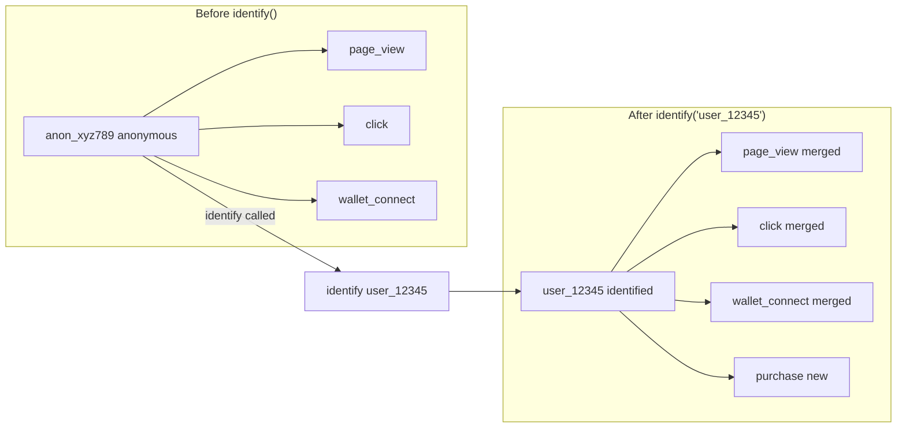
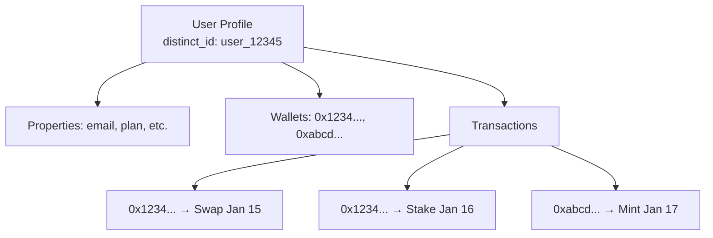

## Overview

User profiles in Cryptique aggregate all data about a single user: their events, properties, connected wallets, and on-chain transactions. This creates a complete picture of each user's journey.

## Profile Structure

```javascript
{
  // Identity
  "distinct_id": "user_12345",
  "user_identity_id": "uuid-xxx-xxx",
  
  // Core properties
  "email": "user@example.com",
  "username": "defi_whale",
  "name": "John Doe",
  
  // Lifecycle
  "first_seen": "2024-01-01T00:00:00Z",
  "last_seen": "2024-01-15T10:30:00Z",
  "session_count": 47,
  "event_count": 1250,
  
  // Custom properties
  "plan": "pro",
  "referral_source": "twitter",
  "onboarding_completed": true,
  
  // Web3 properties
  "is_web3_user": true,
  "wallets": [
    "0x1234567890abcdef1234567890abcdef12345678",
    "0xabcdef1234567890abcdef1234567890abcdef12"
  ],
  "primary_wallet": "0x1234567890abcdef1234567890abcdef12345678",
  
  // Enriched properties (from wallet)
  "wallet_age_days": 847,
  "total_transaction_count": 523,
  "eth_balance": 15.5,
  "is_whale": true
}
```

## Creating & Updating Profiles

### identify()

Link a distinct_id to user properties:

```javascript
Cryptique.identify('user_12345', {
  email: 'user@example.com',
  name: 'John Doe',
  plan: 'pro',
  signup_date: '2024-01-01'
});
```

**When to call identify()**:
- User logs in
- User signs up
- User updates their profile
- You learn new information about the user

### people.set()

Set profile properties (overwrites existing):

```javascript
Cryptique.people.set({
  plan: 'enterprise',
  company: 'Acme Corp',
  team_size: 50
});
```

### people.set_once()

Set properties only if not already set:

```javascript
Cryptique.people.set_once({
  first_purchase_date: '2024-01-15',
  referral_source: 'twitter',
  original_plan: 'free'
});
```

### people.increment()

Increment numeric properties:

```javascript
Cryptique.people.increment({
  login_count: 1,
  total_swaps: 5,
  lifetime_volume_usd: 1500.00
});
```

### people.append()

Add items to list properties:

```javascript
Cryptique.people.append({
  favorite_tokens: 'ARB',
  visited_pages: '/swap'
});
```

### people.union()

Add unique items to list properties:

```javascript
Cryptique.people.union({
  connected_chains: ['ethereum', 'arbitrum'],
  used_features: ['swap', 'bridge']
});
```

### people.remove()

Remove items from list properties:

```javascript
Cryptique.people.remove({
  watchlist: 'DOGE'
});
```

### people.unset()

Delete properties from profile:

```javascript
Cryptique.people.unset(['temporary_flag', 'deprecated_field']);
```

### people.delete()

Delete entire profile:

```javascript
Cryptique.people.delete();
```

<Warning>
This permanently deletes the user profile and cannot be undone.
</Warning>

## Distinct ID

The `distinct_id` uniquely identifies a user. Cryptique handles this automatically:

### Anonymous Users

Before identification, users get an anonymous ID:

```javascript
// Auto-generated format
distinct_id: "anon_a1b2c3d4e5f6"
```

### Identified Users

After calling `identify()`:

```javascript
Cryptique.identify('user_12345');
// distinct_id becomes: "user_12345"
```

### ID Merge

When an anonymous user identifies, their history is linked:



## Wallet Linking

### Automatic Linking

When using `wallet.connect()`, wallets are automatically linked to profiles:

```javascript
Cryptique.walletAddress('0x1234...');

// Profile now includes:
// {
//   "wallets": ["0x1234..."],
//   "is_web3_user": true
// }
```

### Multiple Wallets

Users can connect multiple wallets:

```javascript
Cryptique.walletAddress('0x1234...'); // First wallet
Cryptique.walletAddress('0xabcd...'); // Second wallet

// Profile:
// {
//   "wallets": ["0x1234...", "0xabcd..."],
//   "primary_wallet": "0x1234..."  // First connected
// }
```

### Transaction Attribution

Once linked, all transactions from user's wallets are attributed to their profile:



## Wallet Enrichment

When enabled, wallet data enriches user profiles automatically:

| Property | Description |
|----------|-------------|
| `wallet_age_days` | Days since first transaction |
| `total_transaction_count` | Total transactions across chains |
| `eth_balance` | Current ETH balance |
| `token_holdings` | Major tokens held |
| `nft_count` | Number of NFTs owned |
| `defi_protocols_used` | Protocols interacted with |
| `is_whale` | High-value wallet flag |
| `activity_score` | Engagement scoring |

See [Wallet Enrichment](/integrations/wallet-enrichment) for configuration.

## Profile Timeline

View complete user journey in the dashboard:

```
user_12345 Timeline
───────────────────
Jan 1, 10:00  │ page_view      │ Landing page
Jan 1, 10:02  │ click          │ "Learn More" button
Jan 2, 14:30  │ wallet_connect │ 0x1234... (MetaMask)
Jan 2, 14:35  │ swap_initiated │ ETH → USDC
Jan 2, 14:36  │ [Transaction]  │ Swap on Uniswap
Jan 5, 09:00  │ identify       │ email: user@example.com
Jan 5, 09:05  │ subscription   │ Plan: Pro
```

## Searching Users

Find users by:

- **distinct_id**: Direct lookup
- **wallet_address**: Find by any connected wallet
- **email**: If set via identify/people
- **Custom properties**: Any property you've set

```
Search: 0x1234...
→ Found: user_12345 (wallet linked Jan 2)

Search: user@example.com  
→ Found: user_12345 (email set Jan 5)
```

## Profile Properties vs Event Properties

| Aspect | Profile Properties | Event Properties |
|--------|-------------------|------------------|
| Scope | User-level | Event-level |
| Persistence | Stored on profile | Stored with event |
| Updates | Mutable (set, increment) | Immutable |
| Use case | User attributes | Event context |

**Example**:

```javascript
// Profile property - describes the user
Cryptique.people.set({ plan: 'pro' });

// Event property - describes this specific action
Cryptique.track('feature_used', {
  feature_name: 'advanced_charts',  // event context
  // plan: 'pro' - available from profile in reports
});
```

## Best Practices

### Set meaningful properties

```javascript
// ✅ Good - Useful for segmentation
Cryptique.identify('user_12345', {
  plan: 'pro',
  company_size: 'enterprise',
  industry: 'defi',
  signup_source: 'product_hunt'
});

// ❌ Avoid - Not useful
Cryptique.identify('user_12345', {
  random_id: 'abc123',
  internal_flag: true
});
```

### Use appropriate methods

```javascript
// ✅ set() for current state
Cryptique.people.set({ plan: 'pro' });

// ✅ set_once() for first occurrence
Cryptique.people.set_once({ first_purchase_date: '2024-01-15' });

// ✅ increment() for counters
Cryptique.people.increment({ login_count: 1 });

// ❌ Don't use set() for counters
Cryptique.people.set({ login_count: 47 }); // Race condition!
```

### Handle privacy

```javascript
// ✅ Only collect necessary data
Cryptique.identify('user_12345', {
  plan: 'pro',
  country: 'US'
});

// ❌ Don't collect sensitive data unnecessarily
Cryptique.identify('user_12345', {
  ssn: '123-45-6789',        // Never!
  credit_card: '4111...',    // Never!
  password: '...'            // Never!
});
```

## Next Steps

<CardGroup cols={2}>
  <Card title="People Methods" icon="users" href="/data-in/sdk-reference/people">
    Full people API reference
  </Card>
  <Card title="Wallet Methods" icon="wallet" href="/data-in/sdk-reference/wallet">
    Wallet connection methods
  </Card>
</CardGroup>
