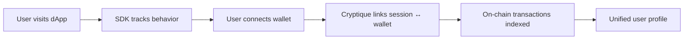

## What is Cryptique?

Cryptique is a unified analytics platform for Web3 applications that automatically connects off-chain user behavior with on-chain transaction data. Think **"Mixpanel + Dune Analytics in one platform, but they actually talk to each other."**

### The Problem We Solve

Web3 product teams are stuck using separate tools—Mixpanel for behavior, Dune for blockchain data—and manually stitching them together with spreadsheets. This wastes **10+ hours per week** and leaves massive blind spots in understanding the complete user journey.

### The Solution

Cryptique automatically links wallet addresses to user sessions, unifying behavioral analytics and on-chain transaction data in real-time. Teams get complete visibility from landing page to transaction—**without writing SQL or exporting CSVs**.

<CardGroup cols={2}>
  <Card
    title="Quickstart"
    icon="rocket"
    href="/guide/quickstart"
  >
    Get up and running in 5 minutes
  </Card>
  <Card
    title="Installation"
    icon="download"
    href="/guide/installation"
  >
    NPM package or CDN script tag
  </Card>
  <Card
    title="SDK Reference"
    icon="code"
    href="/guide/sdk-reference/track"
  >
    Complete method documentation
  </Card>
  <Card
    title="Supported Chains"
    icon="link"
    href="/integrations/overview"
  >
    35+ chains for smart contracts
  </Card>
</CardGroup>

## Core Capabilities

<AccordionGroup>
  <Accordion title="Unified Analytics" icon="layer-group">
    Automatically connect off-chain behavior with on-chain transactions via wallet addresses. No manual CSV exports, no spreadsheet VLOOKUPs, no engineering required.
    
    - **Unified User Profiles**: Every user is a hub linking sessions, events, wallet addresses, and transactions
    - **Cross-Chain Tracking**: See activity across Ethereum, L2s, sidechains in one place
    - **Real-Time Sync**: Off-chain and on-chain data updates every 15 seconds
  </Accordion>
  
  <Accordion title="Behavioral Analytics" icon="chart-line">
    Track every click, scroll, session, and form submission. Build funnels, retention curves, and user flows to find friction before users bounce.
    
    - **10 Auto-Tracked Events**: Page views, clicks, scrolls, form interactions, and more
    - **Custom Event Tracking**: Track any action specific to your dApp
    - **Session Recording**: Watch what users actually do (privacy-safe)
  </Accordion>
  
  <Accordion title="On-Chain Analytics" icon="cube">
    Index transactions, track token transfers, and analyze contract interactions across 35+ chains—without writing SQL.
    
    - **Automatic Contract Indexing**: Add your contract address and we handle the rest
    - **Real-Time Data**: 15-second sync vs. hours for traditional blockchain analytics
    - **Historical Backfill**: Index from contract deployment block
  </Accordion>
  
  <Accordion title="Cross-Protocol Insights" icon="globe">
    Track wallet activity across the entire Web3 ecosystem. See where users transact when they leave your dApp.
    
    - **Net Worth Tracking**: Total wallet value across protocols
    - **dApp Interaction History**: Every protocol the wallet has used
    - **Token Holdings**: All ERC-20 tokens and positions
  </Accordion>
</AccordionGroup>

## How It Works

When a user connects their wallet to your dApp, Cryptique automatically:

1. **Links** the wallet address to their current session
2. **Backfills** all their previous sessions (if they visited before)
3. **Syncs** on-chain transactions in real-time
4. **Enriches** their profile with cross-protocol activity

## Quick Links

<CardGroup cols={3}>
  <Card title="Sign Up" icon="user-plus" href="https://app.cryptique.io/signup">
    Create your free account
  </Card>
  <Card title="Dashboard" icon="gauge" href="https://app.cryptique.io">
    Access your analytics
  </Card>
  <Card title="Support" icon="headset" href="https://tawk.to/chat/697c9c380c73c21c37c52292/1jg7c4fos">
    Get help from our team
  </Card>
</CardGroup>

---

**Questions?** Reach out at [hello@cryptique.io](mailto:hello@cryptique.io) or chat with us via the support widget.
